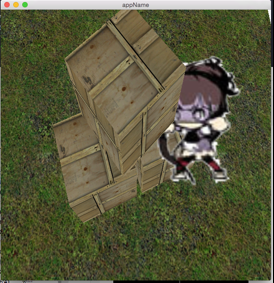

## cppgl 
a C++ wrapper for modern OpenGL

#####[Example](https://github.com/iichenbf/cppgl/blob/master/cppgl/cppgl.cpp):

#####A more complex example in [Lua2d](https://github.com/iichenbf/lua2d):

#####Changes:

- 20150504 use shared_ptr<> instead of GC.
- 20150512 add mesh support.

#####TODO:

- add EBO